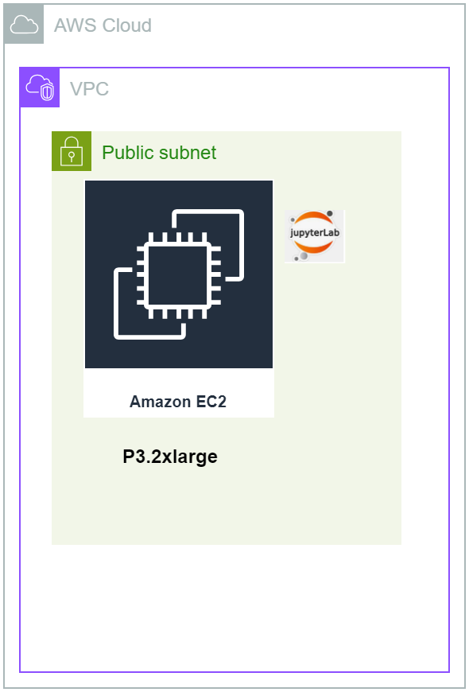

# CUDA Tutorial on Amazon EC2 P3.2xlarge Instance using Pytorch and Huggingface Transformers

## Overview
In this tutorial, we will:

1. Create a GPU instance in AWS – p3.2xl instance with one NVIDIA Tesla V100 GPU

2. Install compatible version of CUDA toolkit and ensure that the toolkit is installed and visible and ready to go

3. Explore basics of CUDA programming with a few examples that exploit the parallelism of GPUs using threads, grids and blocks

4. Install compatible version of Pytorch that is compatible with the CUDA toolkit version

5. Run python code within a Jupyter notebook that shows how to identify GPU properties within Pytorch framework

6. Run python code within a Jupyter notebook to demonstrate how to download a model from Huggingface transformers and run inference with the model using CPU and then run the same inference using the GPU


## Architecture
Our architecture consists of a MP3.2xlarge  EC2 instance. The VM is within a public subnet of our VPC in an AWS region. The ports 22 is open to allow SSH connection. Port 8888 is open for the connecting to the jupyter notebook.

We will install Jupyterlab in the EC2 instance and run the demo using the provided notebook.

For the CUDA programs we will explore in this tutorial, the CUDA code is provided in the repository.




## Pre-requisites
- Access to an AWS account and privilege to setup EC2 instances
- Knowledge of setting up EC2 instances
- Basic familiarity with running CLI commands, SSH, and running Jupyter notebook

## Setup Steps
Please follow the steps in sequence

### Step-01
Launch an EC2 instance from AWS Console. Select US-East-1 region, since it is likely to have better availability in that region. Specs for the EC2 instance as follows.

> P3.2xlarge
>
> Ubuntu 20.04
>
> 250 GB disk storage
>
> Enable public IP
>
> Inside your existing VPC or default VPC
>
> Create a key pair or use your existing key pair
>
> Create a security group or use your existing security group. Inbound rules needed for security group are:
>> open port 22 for SSH from your desired IP address
>>
>> open port 8888 for connecting to jupyter notebook from your desired IP address
>
> Wait until the EC2 instance is fully launched and ready

### Step-02
Log into the EC2 instance via SSH. You will need the EC2 key pair that you created or reused in the earlier step. Since the OS is ubuntu 20.04, your ssh login username will be ubuntu.

You can use your favorite SSH clients like putty or bitvise or even log in from your command line.

Once logged in you will be at the directory `/home/ubuntu`

### Step-03
Run the following commands.

Update the OS

`sudo apt-get update`

`sudo apt-get upgrade -y`

### Step-04
Ubuntu 20.04 comes with Python 3.8. For some of the libraries and dependencies we will use later, we need Python 3.10. The instructions in this step will install Python 3.10

`sudo apt update`

`sudo apt-get install software-properties-common`

`sudo apt update`

`add-apt-repository --help`

`sudo add-apt-repository ppa:deadsnakes/ppa`
*Press Enter when prompted*

`sudo apt-get update`

`apt list | grep python3.10`

`sudo apt-get install python3.10 -y`

`sudo update-alternatives --install /usr/bin/python3 python3 /usr/bin/python3.8 1`

`sudo update-alternatives --install /usr/bin/python3 python3 /usr/bin/python3.10 2`

`sudo update-alternatives --config python3`

Choose the selection for python3.10 manual mode and press enter. It should look like below.

```
Selection    Path                 Priority   Status
------------------------------------------------------------
* 0            /usr/bin/python3.10   2         auto mode
  1            /usr/bin/python3.10   2         manual mode
  2            /usr/bin/python3.8    1         manual mode

Press <enter> to keep the current choice[*], or type selection number:
```

`python3 -V`

It will show python 3.10 version like below

```
ubuntu@ip-172-31-27-187:~$ python3 -V
Python 3.10.14
```

### Step-05
In this step, we will install CUDA toolkit. The CUDA compatibility guide is published here - https://docs.nvidia.com/deploy/cuda-compatibility/index.html. The Pytorch version compatibility guide is published here - https://pytorch.org/. At the time of writing this tutorial, the latest stable version of Pytorch is 2.2.2. This is the version we will use. For Pytorch 2.2.2 along with Linux OS, Pip distribution channel, programming language Python, the version of CUDA that are compatible are 11.8 and 12.1. In our demo we will use CUDA version 11.8. Run the below instructions from the ```/home/ubuntu``` folder to install CUDA 11.8. The instructions for installing CUDA Toolkit 11.8 is found here - https://developer.nvidia.com/cuda-11-8-0-download-archive. We will be doing the deb (local) installer type.

`wget https://developer.download.nvidia.com/compute/cuda/repos/ubuntu2004/x86_64/cuda-ubuntu2004.pin`

`sudo mv cuda-ubuntu2004.pin /etc/apt/preferences.d/cuda-repository-pin-600`

`wget https://developer.download.nvidia.com/compute/cuda/11.8.0/local_installers/cuda-repo-ubuntu2004-11-8-local_11.8.0-520.61.05-1_amd64.deb`

`sudo dpkg -i cuda-repo-ubuntu2004-11-8-local_11.8.0-520.61.05-1_amd64.deb`

`sudo cp /var/cuda-repo-ubuntu2004-11-8-local/cuda-*-keyring.gpg /usr/share/keyrings/`

`sudo apt-get update`

`sudo apt-get -y install cuda` *This step takes a few minutes, please be patient*

> For the changes to take effect, we need to reboot the machine. The command below reboots the machine. Wait a couple of minutes after it is rebooted, connect back via ssh. Once you connect back, make sure to be in the ```/home/ubuntu``` folder

`sudo reboot`

> After connecting back via SSH, we need to check if the CUDA Toolkit and the NVIDIA drivers got installed correctly. Run the below command

`nvidia-smi` *The output should look like below*

```
+-----------------------------------------------------------------------------+
| NVIDIA-SMI 520.61.05    Driver Version: 520.61.05    CUDA Version: 11.8     |
|-------------------------------+----------------------+----------------------+
| GPU  Name        Persistence-M| Bus-Id        Disp.A | Volatile Uncorr. ECC |
| Fan  Temp  Perf  Pwr:Usage/Cap|         Memory-Usage | GPU-Util  Compute M. |
|                               |                      |               MIG M. |
|===============================+======================+======================|
|   0  Tesla V100-SXM2...  On   | 00000000:00:1E.0 Off |                    0 |
| N/A   25C    P0    22W / 300W |      4MiB / 16384MiB |      0%      Default |
|                               |                      |                  N/A |
+-------------------------------+----------------------+----------------------+

+-----------------------------------------------------------------------------+
| Processes:                                                                  |
|  GPU   GI   CI        PID   Type   Process name                  GPU Memory |
|        ID   ID                                                   Usage      |
|=============================================================================|
|    0   N/A  N/A       897      G   /usr/lib/xorg/Xorg                  4MiB |
+-----------------------------------------------------------------------------+
```

> Next, add the CUDA path in the PATH environment variable

`sudo nano /home/$USER/.bashrc`

Inside there add the following: 

```
export PATH="/usr/local/cuda-11.8/bin:$PATH"
export LD_LIBRARY_PATH="/usr/local/cuda-11.8/lib64:$LD_LIBRARY_PATH"
```

Then do the following to save and close the editor:

```
On you keyboard press the following: 

 ctrl + o             --> save 
 enter or return key  --> accept changes
 ctrl + x             --> close editor
```

`source .bashrc`

`nvcc --version`


### Step-06
In this step, we will create a python virtual environment, we will call it ```cuda_tutorial```. In this virtual environment, we will install Pytorch and Jupyterlab. This virtual environment will be used in later steps for running all the code within Jupyter notebooks with Pytorch and Huggingface transformers.


Install pip

`sudo apt-get install python3-pip`

`sudo apt-get install python3.10-venv`

`python3.10 -m venv cuda_tutorial`

`source cuda_tutorial/bin/activate`

`pip3 install torch torchvision torchaudio --index-url https://download.pytorch.org/whl/cu118` *This command comes from ```pytorch.org``` based on selection of Pytorch version 2.2.2, Linux, PIP, Python and CUDA 11.8*


> Next we will install and configure Jupyterlab

`pip3 install jupyterlab jupyter`

Generate Jupyter notebook configuration file

`jupyter notebook --generate-config`

> note the path to the configuration file is /home/ubuntu/.jupyter/jupyter_notebook_config.py

Create Jupyter notebook password

`jupyter notebook password`
>
> you enter the password of your choice. You will need to re-enter the password to confirm

## Run CUDA Programs - Few Examples
Log into the machine via SSH and make sure you are in the ```home/ubuntu``` folder. We will create a folder called ```cuda_project`` and create the CUDA programs in that directory.

`sudo mkdir cuda_project`

`cd cuda_project`

### Example-01
The first example will simply write hello world to the terminal. But the difference is that this will be processed in the GPU and not from the CPU.

`sudo nano hello.cu` *In the editor, paste in or type in the code below*

```
#include "cuda_runtime.h"
#include "device_launch_parameters.h"

#include <stdio.h>

__global__ void cuda_hello(){
    printf("Hello World from GPU!\n");
}

int main() {
    cuda_hello<<<1,1>>>();
    cudaDeviceSynchronize();
    cudaDeviceReset(); 
    return 0;
}
```
Exit the editor and save the file using ```Control + X``` keys followed with a ```Y``` to confirm the save and then hit ```Enter``` key.

Compile the code `sudo nvcc hello.cu -o hello`

Run the code `sudo ./hello`

You should be able to see ```Hello World from GPU!``` printed on the terminal

> In order to see the GPU function calls, run the program with the following command.

`sudo nvprof ./hello` *You should see an out like below*

```
==4398== NVPROF is profiling process 4398, command: ./hello
Hello World from GPU!
==4398== Profiling application: ./hello
==4398== Profiling result:
            Type  Time(%)      Time     Calls       Avg       Min       Max  Name
 GPU activities:  100.00%  43.488us         1  43.488us  43.488us  43.488us  cuda_hello(void)
      API calls:   82.68%  266.55ms         1  266.55ms  266.55ms  266.55ms  cudaLaunchKernel
                   17.25%  55.609ms         1  55.609ms  55.609ms  55.609ms  cudaDeviceReset
                    0.04%  122.77us        97  1.2650us     152ns  50.856us  cuDeviceGetAttribute
                    0.02%  66.544us         1  66.544us  66.544us  66.544us  cudaDeviceSynchronize
                    0.01%  22.870us         1  22.870us  22.870us  22.870us  cuDeviceGetName
                    0.00%  6.2840us         1  6.2840us  6.2840us  6.2840us  cuDeviceGetPCIBusId
                    0.00%  1.4090us         3     469ns     150ns  1.0090us  cuDeviceGetCount
                    0.00%     856ns         2     428ns     168ns     688ns  cuDeviceGet
                    0.00%     619ns         1     619ns     619ns     619ns  cuDeviceTotalMem
                    0.00%     269ns         1     269ns     269ns     269ns  cuDeviceGetUuid
```

### Example-02
The second example will use 64 threads in parallel. We will use a 2D grid of 2 X 2. Inside the grid, we will use each thread block to be a 2D 8 X 2 matrix, which means each thread block will have 16 threads. It will write hello world to the terminal 64 times. This will be processed in the GPU and not from the CPU.

`sudo nano hello_with_grid_block.cu` *In the editor, paste in or type in the code below*

```
#include "cuda_runtime.h"
#include "device_launch_parameters.h"

#include <stdio.h>

__global__ void hello_cuda()
{
	printf("Hello CUDA world \n");
}

// Begin Documentation
//  In this example, we are considering a grid with 64 threads as a 16 X 4 2D matrix. 
//  Inside this grid, we will have each thread block with 16 threads, arranged into a 2D matrix 
//  of 8 X 2. For the grid, we will have the thread blocks arranged in a 2D  2 X 2 grid.
//  When this program executes, it will execute 64 threads in the GPU, and will print
//  out "Hello World" 64 times.
// End Documentation

int main()
{
	int nx, ny;
	nx = 16;
	ny = 4;

	dim3 block(8, 2);
	dim3 grid(nx / block.x,ny / block.y);

	hello_cuda << < grid, block >> > ();
	cudaDeviceSynchronize();

	cudaDeviceReset();
	return 0;
}
```

Exit the editor and save the file using ```Control + X``` keys followed with a ```Y``` to confirm the save and then hit ```Enter``` key.

Compile the code `sudo nvcc hello_with_grid_block.cu -o hello_with_grid_block`

Run the code `sudo ./hello_with_grid_block`

You should be able to see ```Hello World from GPU!``` printed on the terminal 64 times

### Example-03
In this example, we will write a CUDA program to do the sum of two arrays where the computation for the sum will happen in GPU using 256 threads. We will define a 1D block with 256 threads. We will have a 1D grid with 1 block.

`sudo nano sum_array.cu` *In the editor, paste in or type in the code below*
```
#include <stdio.h>

// Kernel function to add two arrays
__global__ void addArrays(int *a, int *b, int *c, int size) {
    int tid = threadIdx.x + blockIdx.x * blockDim.x;
    if (tid < size) {
        c[tid] = a[tid] + b[tid];
    }
}

int main() {
    int size = 100; // Size of the arrays
    int a[size], b[size], c[size]; // Host arrays
    int *d_a, *d_b, *d_c; // Device arrays

    // Initialize arrays
    for (int i = 0; i < size; i++) {
        a[i] = i;
        b[i] = i * 2;
    }

    // Allocate memory on GPU
    cudaMalloc((void **)&d_a, size * sizeof(int));
    cudaMalloc((void **)&d_b, size * sizeof(int));
    cudaMalloc((void **)&d_c, size * sizeof(int));

    // Copy data from host to device
    cudaMemcpy(d_a, a, size * sizeof(int), cudaMemcpyHostToDevice);
    cudaMemcpy(d_b, b, size * sizeof(int), cudaMemcpyHostToDevice);

    // Define grid and block dimensions
    int blockSize = 256;
    int numBlocks = (size + blockSize - 1) / blockSize;

    // Launch kernel
    addArrays<<<numBlocks, blockSize>>>(d_a, d_b, d_c, size);

    // Copy result from device to host
    cudaMemcpy(c, d_c, size * sizeof(int), cudaMemcpyDeviceToHost);

    // Print result
    printf("Result:\n");
    for (int i = 0; i < size; i++) {
        printf("%d + %d = %d\n", a[i], b[i], c[i]);
    }

    // Free device memory
    cudaFree(d_a);
    cudaFree(d_b);
    cudaFree(d_c);

    return 0;
}
```

Exit the editor and save the file using ```Control + X``` keys followed with a ```Y``` to confirm the save and then hit ```Enter``` key.

Compile the code `sudo nvcc sum_array.cu -o sum_array`

Run the code `sudo ./sum_array`

You should be able to see sum of the arrays printed on the terminal. It should look like below, pasting a partial screen shot

```
87 + 174 = 261
88 + 176 = 264
89 + 178 = 267
90 + 180 = 270
91 + 182 = 273
92 + 184 = 276
93 + 186 = 279
94 + 188 = 282
95 + 190 = 285
96 + 192 = 288
97 + 194 = 291
98 + 196 = 294
99 + 198 = 297
ubuntu@ip-172-31-27-187:~/cuda_project$
```

## Run Jupyter Notebook showing GPU properties within Pytorch
> Navigate back to the ```/home/ubuntu``` folder

`cd /home/ubuntu`
> Activate the ```cuda_tutorial``` virtual environment we created earlier

`source cuda_tutorial/bin/activate`

> Start the Jupyterlab

`jupyter-lab --ip 0.0.0.0 --no-browser --allow-root`

Do not press control + C, keep this running, so that you can access the Jupyter notebook from your web browser.

Access the Jupyter notebooks provided in the repository and run the instructions within the notebook provided to test the GPU properties and usage within Pytorch Framework. 


We will test three notebooks in this step. The notebooks are called ```CUDA_01.ipynb```, ```CUDA_02.ipynb```, and ```CUDA_03.ipynb```. We will test one notebook at a time.

Open your favorite browser, like Chrome or something you use. On the address bar line type the following link and press `Enter` key.
`http://Public_IP:8888`, where **Public_IP** is the public IP address of your EC2 instance. You can get the public IP address from the AWS console or CLI

Once the Jupyter notebook opens, give the password you set befor. This will bring you into the Jupyter notebook environment.

Open each of the notebooks ```CUDA_01.ipynb```, ```CUDA_02.ipynb```, and ```CUDA_03.ipynb```, one a time and run the code within each cell of the notebook. The notebook contains documentation and instruction explaining the steps.


## Run Jupyter Notebook to demonstrate how to download a model from Huggingface transformers and run inference with the model using CPU and then run the same inference using the GPU

We will test one notebook in this step. The notebook is called ```CUDA_04.ipynb``` and is included inside the repository.

Once the notebook ```CUDA_04.ipynb``` is launched, run the code within each cell of the notebook. The notebook contains documentation and instruction explaining the steps.

## Destroy AWS Resources to avoid unnecessary billing
Once you are done with the tutorial, please remember to delete or terminate the EC2 resource to avoid paying for that resource


